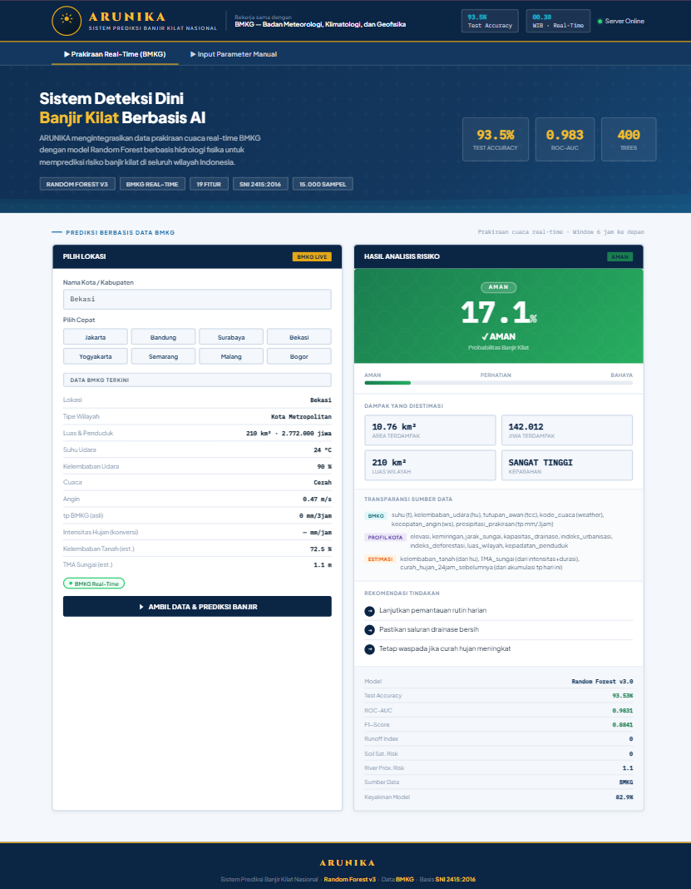

# ARUNIKA
**ARUNIKA is an environmental awareness web application that predicts flood risk levels and presents estimated affected area and potential population impact through a simple, readable, and user-friendly interface.**


---

## Website Preview



> ARUNIKA transforms environmental data into clear flood-risk information to support faster awareness, better understanding, and stronger community concern toward environmental issues.

---

## Overview

Flood risk information is often difficult to understand because it is usually presented through raw numbers, technical data, or complex reports. ARUNIKA was created to solve that problem by turning environmental input data into a simple and understandable visual result.

This project helps users identify flood risk levels, estimate affected areas, and understand potential population impact. By combining prediction logic, environmental data processing, and a clean web interface, ARUNIKA makes disaster-related information easier to access and more meaningful for the public.

---

## Main Purpose

The main goal of ARUNIKA is to make flood-risk information easier to understand for users who may not have technical knowledge about environmental data.

ARUNIKA focuses on:

- Helping users understand flood risk levels more quickly
- Presenting estimated affected areas in a readable format
- Showing potential population impact
- Increasing environmental awareness
- Supporting faster decision-making through simple data interpretation

---

## Key Features

### 1. Flood Risk Prediction

ARUNIKA analyzes environmental input data and generates a flood risk prediction. The result helps users understand whether an area may have low, medium, or high flood risk.

### 2. Estimated Affected Area

The application provides an estimated affected area so users can understand the possible scale of the flood impact.

### 3. Potential Population Impact

ARUNIKA also presents an estimated number of people who may be affected. This helps connect environmental risk with real community impact.

### 4. Simple Result Interpretation

Instead of displaying only raw data, ARUNIKA translates prediction results into clear and readable information.

### 5. Clean Web Interface

The interface is designed to be simple, direct, and comfortable to read. Users can input data, submit it, and view the result without complicated steps.

### 6. Environmental Awareness

This project is not only focused on prediction, but also on building awareness about environmental risks, public safety, and community preparedness.

---

## How ARUNIKA Works

The system follows a simple prediction flow:

```text
User opens the website
        ↓
User enters environmental data
        ↓
The backend receives and processes the input
        ↓
The machine learning model analyzes the data
        ↓
The system generates flood-risk prediction
        ↓
The result is displayed as risk level, affected area, and population impact

```
## How to Run the Project

Follow these steps to run ARUNIKA on your local machine :

### 1. Clone the Repository

```bash
git clone https://github.com/your-username/arunika.git
cd arunika
```

### 2. Create a Virtual Environment

```bash
python -m venv venv
```

### 3. Activate the Virtual Environment

For Windows:

```bash
venv\Scripts\activate
```

For macOS or Linux:

```bash
source venv/bin/activate
```

### 4. Install the Required Dependencies

```bash
pip install -r requirements.txt
```

If `requirements.txt` is not available, install the main dependencies manually:

```bash
pip install flask pandas numpy scikit-learn joblib
```

### 5. Run the Application
Run by using :

```bash
python app.py
```

### 6. Open the Website
After the server starts, open the address in your browser and ARUNIKA web application should now be running locally.
